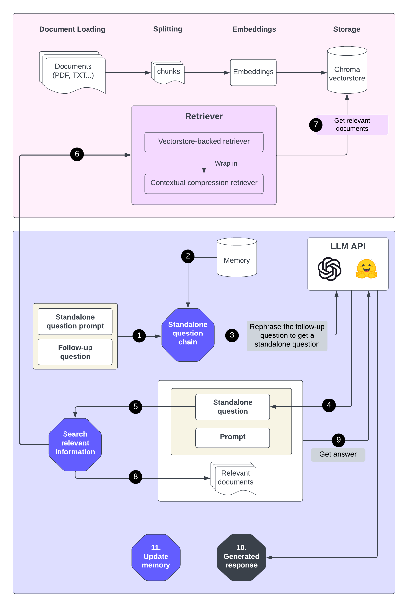

<!-- ──────────────────────────────────────────────────────────────────────────── -->
<!-- Title & Badges                                                             -->
<!-- ──────────────────────────────────────────────────────────────────────────── -->

<h1 align="center">🧠🔗 RAG Chatbot — LangChain × Gemini × OpenAI × Hugging Face</h1>

<p align="center">
  <a href="https://python.org/"></a>
  <a href="https://streamlit.io/"></a>
  <a href="https://docs.langchain.com/"></a>
  <a href="#"></a>
</p>

<p align="center"><em>
Ask anything about your private PDFs, DOCX, CSV or TXT files and receive<br>
LLM-sized answers with inline citations — all through a slick Streamlit interface.
</em></p>

<div align="center">
  
  <p><strong>Fig. 1 — End-to-end Retrieval-Augmented Generation pipeline built with LangChain components.</strong></p>
</div>

---

## ✨ Why this project?

Large Language Models are brilliant but **static** — they can hallucinate or miss fresh facts.  
**Retrieval-Augmented Generation (RAG)** fixes that by injecting your authoritative data into every prompt.

| Layer | Tech | Why it matters |
|-------|------|----------------|
| **Vector store** |  **ChromaDB** | Fast, disk-backed similarity search — no separate server |
| **Embeddings** | OpenAI `text-embedding-3-small`, Gemini `embedding-001`, 🤗 gte-large | Swap providers in one click |
| **LLMs** | GPT-4-turbo · Gemini-2.5-pro · Mistral-7B-Instruct | Balance cost vs. quality |
| **Retrievers** | Vanilla ↔ Contextual Compression ↔ Cohere Rerank | Built-in quality tiers |
| **UI / API** | Streamlit (chat) + FastAPI (optional) | Try in seconds, integrate anywhere |

---

## 🚀 Quick-start (5 minutes)


git clone https://github.com/<your-github-id>/<your-repo>.git
cd <your-repo>

python -m venv .venv && source .venv/bin/activate   # Windows: .venv\Scripts\activate
pip install --upgrade pip && pip install -r requirements.txt

streamlit run RAG_app.py
Tip 🔑 Export keys once before running:
export OPENAI_API_KEY=sk-… GOOGLE_API_KEY=XYZ COHERE_API_KEY=ABC HF_API_KEY=hf_…

🖥️ What you can do
Feature	Free-tier friendly?	Where
Upload PDFs / DOCX / CSV / TXT in bulk	✔️	Sidebar → Create Vectorstore
Mix-and-match embedding & LLM providers	✔️	Provider dropdowns
Long-context compression / reranking	Contextual compression ✔️ · Cohere key required	Retriever type
Source-document citations	✔️	“Source documents” expander
Reload previous indexes instantly	✔️	Tab → Open Vectorstore
Programmatic access	✔️	uvicorn api_fastapi:app

🛠️ Project structure

│
├─ RAG_app.py            ← Streamlit front-end (chat)
├─ api_fastapi.py        ← Optional REST wrapper
├─ rag_core.py           ← Embeddings, vector-store & chain helpers
│
├─ data/
│   ├─ tmp/              ← Ephemeral uploads
│   └─ vector_stores/    ← Saved Chroma indexes
│
└─ requirements.txt
🔧 Extending & deploying
Swap LLMs — any Hugging Face text-generation model works (drop ID in sidebar).

Add loaders — extend rag_core.langchain_document_loader.

Docker — docker compose up --build (see docker-compose.yml).

CI tests — run pytest for chunking, retrieval precision & latency checks.

📝 License
Released under the MIT License.
Feel free to fork, star, and share!

<p align="center"><i>Happy augmenting, and may your answers never hallucinate 👾</i></p> ```
