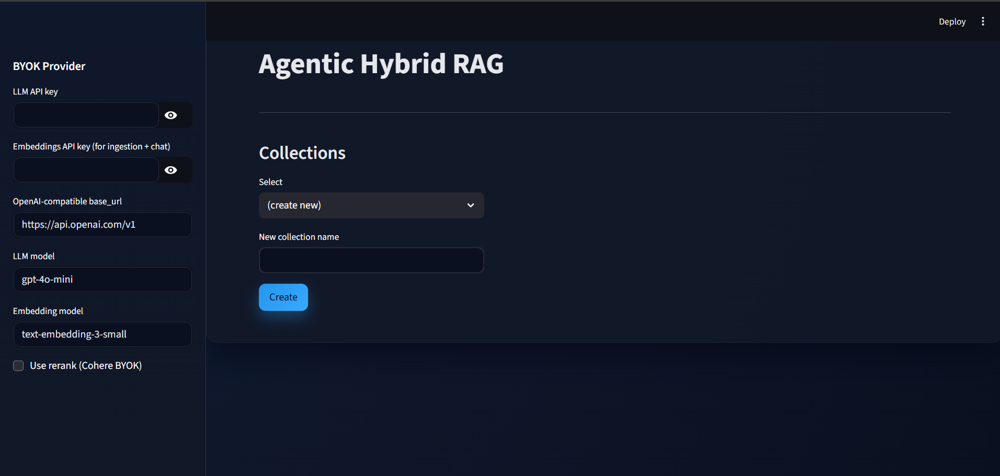

# Agentic Hybrid RAG

[](https://www.python.org/)
[](https://fastapi.tiangolo.com/)
[](https://streamlit.io/)
[](https://www.trychroma.com/)
[](./LICENSE)

Production‑ready RAG app with a clean Streamlit UI, FastAPI backend, background ingestion, and hybrid retrieval (vector + keyword). Built to stay small, stable, and easy to ship.

## Screenshot

Add a screenshot at `docs/screenshot.png` to showcase the UI:



## Features

- Streamlit UI with BYOK (bring your own key) support
- FastAPI service for collections, documents, jobs, and chat
- Async ingestion via RQ + Redis (sync fallback supported)
- Chroma for vector search (persistent local storage)
- SQLite metadata + FTS5 keyword search (hybrid retrieval)
- Deterministic agent flow (no LangChain/LangGraph dependency)

## Quick start (Docker)

1) Create `.env` (see `.env.example`)
2) Run:

```bash
docker compose -f docker/docker-compose.yml up --build
```

Open:
- API: http://localhost:8000/docs
- UI:  http://localhost:8501

## Local dev (no Docker)

Backend:
```bash
cd services/api
python -m venv .venv && . .venv/bin/activate
pip install -r requirements.txt
uvicorn main:app --reload --port 8000
```

Worker (optional):
```bash
cd worker
python -m venv .venv && . .venv/bin/activate
pip install -r ../services/api/requirements.txt
python worker.py
```

UI:
```bash
cd apps/streamlit_ui
python -m venv .venv && . .venv/bin/activate
pip install -r requirements.txt
streamlit run app.py
```

## Configuration

This project ships with BYOK only. Provide keys at runtime in the UI.

- LLM and embeddings use an OpenAI‑compatible API
- Default base URL: `https://api.openai.com/v1`
- Works with OpenAI, Groq, OpenRouter, etc. (set `base_url`)

## Project layout

```
apps/streamlit_ui      Streamlit UI
services/api           FastAPI backend + RAG pipeline
worker/                RQ worker for ingestion
data/                  Local persistence (mounted in Docker)
```

## Architecture

```
User -> Streamlit UI -> FastAPI
                 |        |
                 |        +-> SQLite (metadata, FTS5)
                 |        +-> Chroma (vectors)
                 |
                 +-> Uploads -> Worker (RQ) -> Ingest -> Chroma + SQLite
```

## Data directories

All data persists under `./data/` (mounted in Docker):
- `data/sqlite/app.db` (metadata + FTS)
- `data/chroma/` (vector db)
- `data/blobs/` (uploaded files)

## Troubleshooting

- Ingestion fails at ~75%: check embeddings API key and embedding model.
- `429 Too Many Requests`: LLM provider rate‑limited; wait or use another provider.
- No citations: ensure documents are `ready` and retrieval returns chunks.

## Security note (MVP)

For async ingestion, the server stores the embedding API key in `ingest_jobs` (plain‑text JSON). Encrypt or replace with per‑user secret storage in production.
